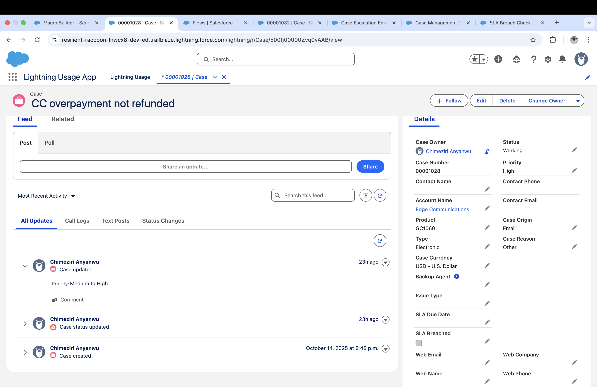
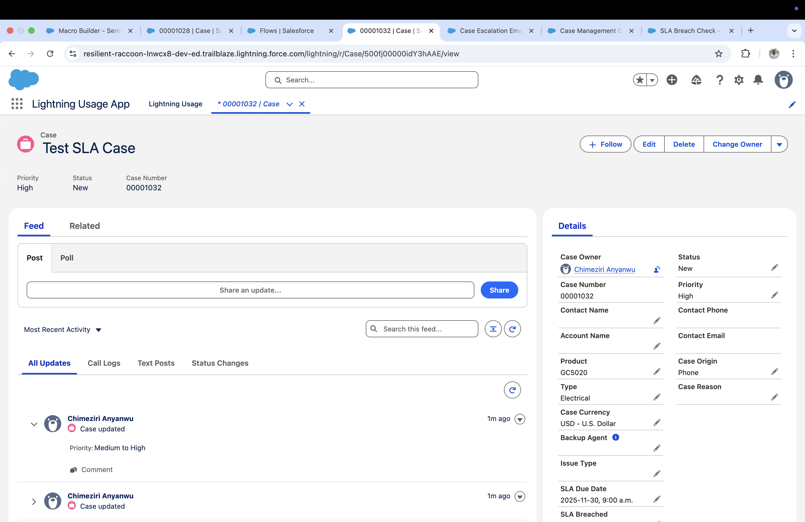
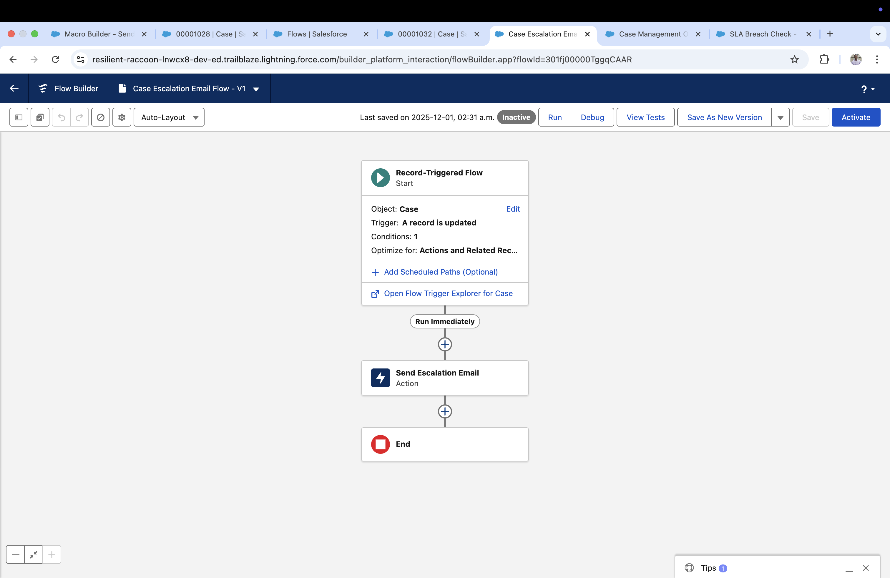
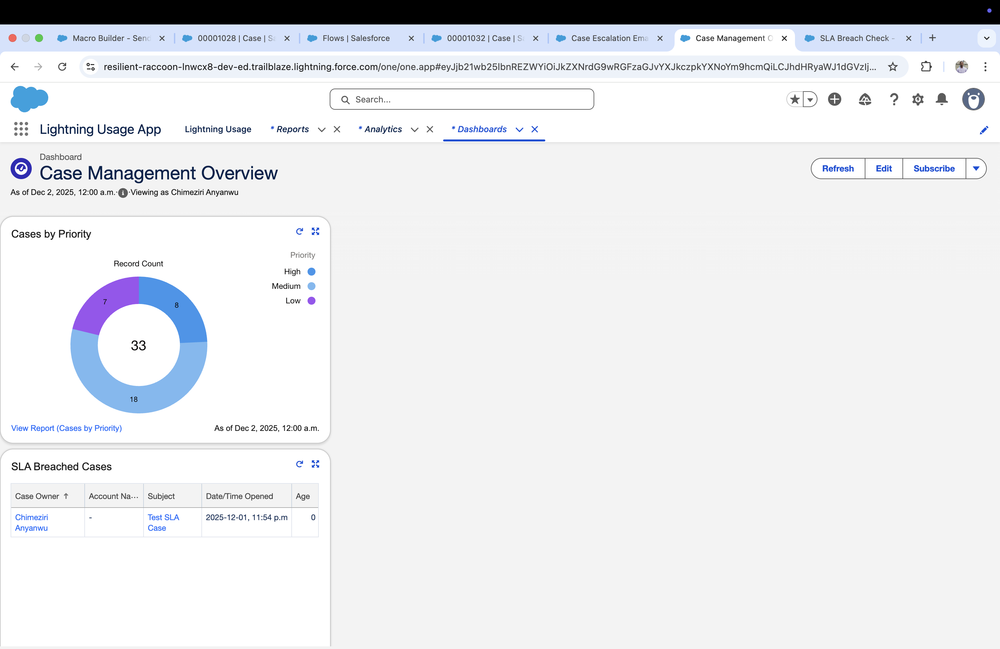
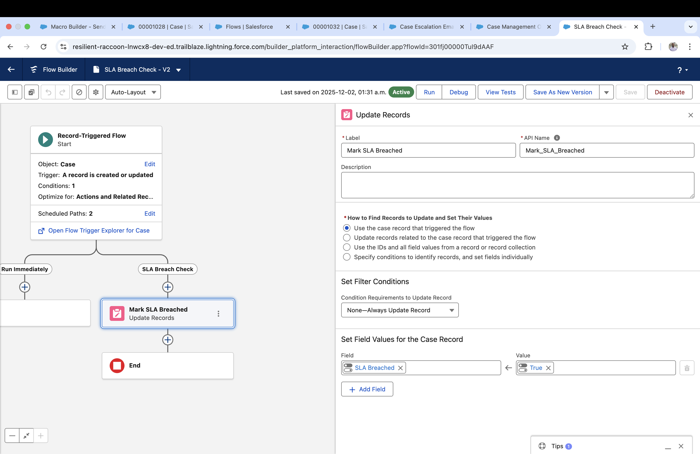

# 🚀 Salesforce Case Management App

  
  
  
  
  
  

---

Apex • Lightning Web Components (LWC) • Flows • Queues • Dashboards  

A full Salesforce Case Management Solution designed to demonstrate real enterprise Salesforce development skills, including Apex Trigger Patterns, LWC form components, automation with Flows, queue routing, and analytics dashboards.

This project is fully implemented and tested in a Salesforce Developer Org.

---

# 🌟 Features

---

## 🔹 1. Apex Case Assignment Engine
- Automatically assigns cases to Tech Support or Billing Support queues  
- Applies Apex Handler Pattern for clean, scalable logic  
- Automatically sets SLA Due Date (+8 hours from creation)  
- Gracefully handles incomplete or invalid cases  

---

## 🔹 2. Lightning Web Component – Quick Case Update
A modern LWC embedded directly on the Case Record Page:

- Update Status  
- Update Priority  
- Add Internal Comments  
- Uses `lightning-record-edit-form` and `updateRecord`  
- Instant UI refresh using LDS (Lightning Data Service)  

---

## 🔹 3. Automation with Flows

### ✔ Escalation Email Flow
Sends an email when Status = Escalated.

### ✔ SLA Breach Flow (Scheduled Path)
Automatically marks `SLA_Breached__c = TRUE` when the SLA Due Date is reached.

---

## 🔹 4. Custom Fields & Data Model Enhancements

Added to the Case object:

| Field | API Name | Type |
|-------|----------|-------|
| Issue Type | Issue_Type__c | Picklist |
| SLA Due Date | SLA_Due_Date__c | Date/Time |
| SLA Breached | SLA_Breached__c | Checkbox |
| Internal Comment | Internal_Comment__c | Long Text |

---

## 🔹 5. Reports & Dashboard
Includes a Case Management Overview Dashboard:

- Cases by Priority (donut chart)  
- SLA Breached Cases (table)  
- Real-time case performance analytics  

---

# 🧩 Project Structure

---

# 📸 Screenshots

### Case Record Page – Updated Case Details

### Case Record Page – SLA Test Case

### Escalation Email Flow

### Case Management Dashboard

### SLA Breach Flow

---

# ⚙️ Setup Instructions

### 1. Clone the Repository

git clone https://github.com/Mezirix/salesforce-case-management-app.git

cd salesforce-case-management-app

### 2. Authorize Salesforce Org
sf org login web -a DevOrg

### 3. Deploy Source

sf project deploy start

### 4. Assign the LWC to Case Page
**Setup → Object Manager → Case → Lightning Record Pages → Edit Page → Drag Quick Case Update → Save & Activate**

---

# 🧪 How to Test the App

### ✔ Test Case Assignment
1. Create a Case  
2. Set:  
   - Issue Type = Technical  
   - Priority = High  
3. Save  
4. Case Owner should automatically update to Tech Queue  

### ✔ Test Escalation Email
1. Open a Case  
2. Change Status → Escalated  
3. Email should trigger  

### ✔ Test SLA Breach Flow
1. Set SLA Due Date to a past time  
2. Edit case once to retrigger flow  
3. `SLA_Breached__c = TRUE`

---

# 🛠️ Technologies Used

- Apex (Trigger, Handler Pattern)  
- Lightning Web Components (LWC)  
- Salesforce Flows  
- Queue Management  
- SOQL  
- Lightning App Builder  
- Dashboards & Reports  
- Git & GitHub  
- VS Code + Salesforce Extensions  

---

# Project 2

🌍 Salesforce Currency Exchange Dashboard

Live Currency API Integration • Apex Callouts • LWC Analytics Dashboard

This project demonstrates a full end-to-end Salesforce integration using external REST APIs, scheduled sync, custom objects, and a Lightning Web Component dashboard for real-time insights.

🚀 Project Overview

A Salesforce solution that retrieves live foreign-exchange rates from an external API, stores them in a custom object, and displays them in a dynamic LWC dashboard using Chart.js visualization.

This project highlights:

Apex HTTP callouts

JSON deserialization into typed classes

Error handling and response validation

Scheduled job for daily updates

LWC table + bar chart visualization

Custom object data storage

Chart.js static resource integration

🛠️ Features
🔹 1. Apex REST API Integration

Fetches real-time currency rates via callout:

Uses HttpRequest + Http classes

Robust error handling for API failures

JSON to Apex deserialization

Returns structured Currency__c records

🔹 2. Custom Currency Object

Stores each currency and its live rate:

Field	Type
Currency_Code__c	Text
Rate__c	Number
Retrieved_On__c	Date/Time
🔹 3. Automated Sync

A daily scheduled Apex job updates all currency records automatically:

Schedulable class

ExternalDataSync orchestrates the pull + upsert

Zero manual work needed

🔹 4. LWC Currency Dashboard

A modern Lightning Web Component displaying:

Interactive bar chart (Chart.js)

Real-time rate table

Responsive UI

Apex Controller → Wire adapters for data sync

🔹 5. Chart.js Static Resource

Included as a static resource bundle for use inside LWC components.

📸 Screenshots
Currency List View

LWC Dashboard Table

LWC Dashboard Chart

App Launcher Tile

📦 Project Structure

force-app/main/default/
│

├── classes/

│   ├── CurrencyApiService.cls
│   ├── ExternalDataSync.cls
│   ├── ExternalDataScheduler.cls
│   ├── CurrencyDashboardController.cls
│

├── objects/

│   └── Currency__c/
│       ├── fields/
│       └── listViews/All.listView-meta.xml
│

├── lwc/

│   └── currencyDashboard/
│       ├── currencyDashboard.html
│       ├── currencyDashboard.js
│       ├── currencyDashboard.css
│       └── currencyDashboard.js-meta.xml
│

└── staticresources/
    └── chartjs.resource  

🧪 How to Test
1️⃣ Run a Live API Pull

Developer Console → Execute Anonymous:

List<Currency__c> records = CurrencyApiService.pullRates();
upsert records;

2️⃣ View Currency Records

Go to App Launcher → Currencies → All.

3️⃣ Open LWC Dashboard

App Launcher → Currency Dashboard.

4️⃣ Trigger Scheduled Sync
System.schedule('Daily Update', '0 0 2 * * ?', new ExternalDataScheduler());

🛠️ Technologies Used

Apex (HTTP Callouts, JSON Parsing)

Lightning Web Components

Chart.js

Custom Metadata & Objects

Scheduler + Batch Logic

Git/GitHub

VS Code + Salesforce CLI

# 👨‍💻 Author  
**Christiantus Chimeziri Anyanwu**  
Salesforce Developer | AI & Cloud Engineer  

GitHub: https://github.com/Mezirix  
LinkedIn: https://www.linkedin.com/in/chimezirianyanwu/

---

# 📜 License  
This project is open-source under the MIT License.

